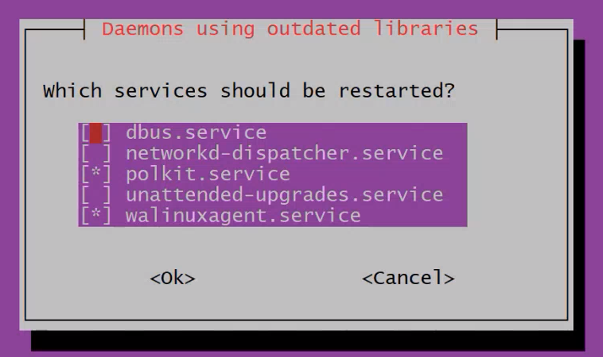
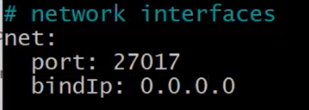

# Setting the database on a VM

## Creating a VM
1. Navigate to` portal.azure.com` -> `Virtual machines` -> `+ Create`
2. **Configuration**:
- basics:
  - `subscription` : Azure Training
  - `resource group` : tech264
  - `vm name` :tech264-name-name
  - `region` : Europe South
  - `availability options` : No infrastructure redundancy required
  - `security type`: standard 
  - `image` : Ubantu Pro 22.04 LTS
  - `size `: Standard_B1s- 1 vcpu, 1Gib memory
  - `username`: adminuser
  - `ssh public key sorce`: use existing key stored in Azure
  - `select inbound ports` : SSH(22)
- networking : 
  - `subset` : private-subset
- tags :
  - `name `: owner
  - `value` : "name"
- review and create
- connect : 
  - `connect` -> `native SSH` and paste the SSH key -> copy `the SSH to VM with specified private key `

3. **Open GitBash** 

## GitBash

**Open GitBash** :

1. `cd .ssh` -> paste the `SSH Key` -> enter
2. `update and upgrade `
-
```bash
 sudo DEBIAN_FRONTEND=noninteractive apt-get update -y
 # DEBIAN_FRONTEND=noninteractive: This environment variable ensures that the command runs in a non-interactive mode, meaning it won't prompt the user for any input during execution. 
```
- 
```bash
sudo DEBIAN_FRONTEND=noninteractive apt-get upgrade -y
```
3.  **From a terminal, install gnupg and curl if they are not already available:**
```bash
sudo apt-get install gnupg curl

# gnupg: stands for GNU Privacy is  used for verifying the authenticity of software packages, signing code, and securing emails using encryption
# curl :  is a command-line tool used to transfer data to or from a server using various protocols such as HTTP, HTTPS, FTP
```

4. **To import the MongoDB public GPG key, run the following command**:
```bash
curl -fsSL https://www.mongodb.org/static/pgp/server-8.0.asc | \
   sudo gpg -o /usr/share/keyrings/mongodb-server-8.0.gpg \
   --dearmor
```
5. **Create the list file for Ubuntu 22.04**:
```bash
echo "deb [ arch=amd64,arm64 signed-by=/usr/share/keyrings/mongodb-server-7.0.gpg ] https://repo.mongodb.org/apt/ubuntu jammy/mongodb-org/7.0 multiverse" | sudo tee /etc/apt/sources.list.d/mongodb-org-7.0.list
```
6. **Reload the Package Database( to find the latest version)**:
```bash
sudo apt-get update -y
```

7. **Install MongoDB** :
```bash
sudo DEBIAN_FRONTEND=noninteractive apt-get install -y mongodb-org=7.0.6 mongodb-org-database=7.0.6 mongodb-org-server=7.0.6 mongodb-mongosh=2.1.5 mongodb-org-mongos=7.0.6 mongodb-org-tools=7.0.6
```

8. **If this image pops up**: `tab -> enter`


9. **Check if the database is running** :
```bash
sudo systemctl status mongod
```

10. **Start MongoDB** :
```bash
sudo systemctl start mongod
```

11. **Rerun the status command**

12. **Changing the** `bindIp` 
```bash
#By default, MongoDB launches with bindIp set to 127.0.0.1, which binds to the localhost network interface. This means that the mongod can only accept connections from clients that are running on the same machine.

sudo nano /etc/mongod.conf

# change to 0.0.0.0 - means accepting connections from any IP
```


13. **Restart the database:**
```bash
sudo systemctl restart mongod
```

14. **Status the database( to see if is active(running)):**
```bash
sudo systemctl status mongod
```
15. **Check and set the database to start when you start the VM:**
```bash
sudo systemctl is-enabled mongod
#check
```
```bash
sudo systemctl enable mongod
#set
```
16.  `Start the first VM` and open a `new Bash` window without closing the first one  -> `connect the VM` with Bash with `native SSH` -> `enter` -> `ls` -> `cd app` ->[app](app.png) 

17.  **Connect the app to database:**
```bash
export DB_HOST=mongodb://"private IP address":27017/posts
# 27017 - default mongoDB port
# private IP address change with ur private one
```

18. **Check if is set correctly:**
```bash
printenv DB_HOST
```

19. **Connecting to database:**
```bash
npm install
```


20. **Start:**
```bash
npm start
```
21. `Coppy the public IP address from the VM `and paste it into a browser and attach `:3000/posts `

22. **If the page is not seeded:**
```bash
node seeds/seed.js
```
